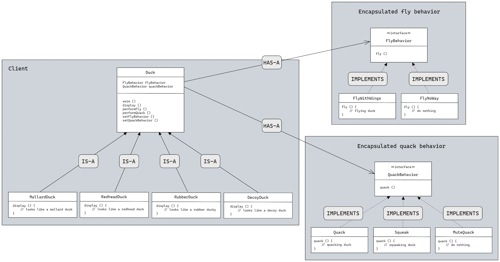
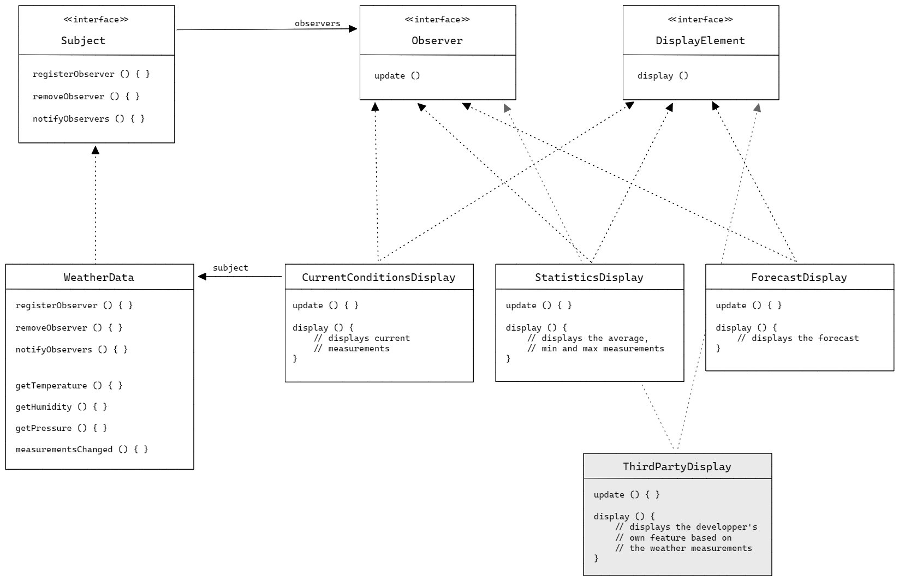
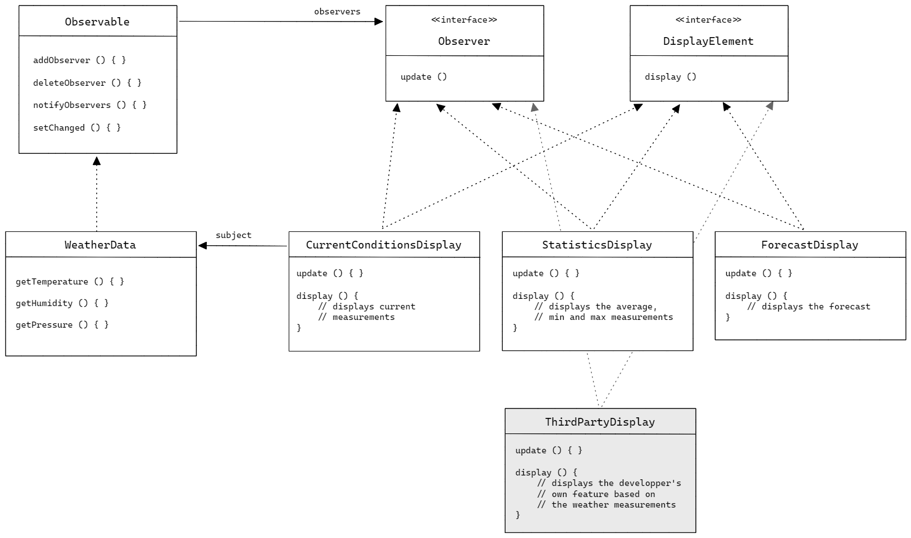
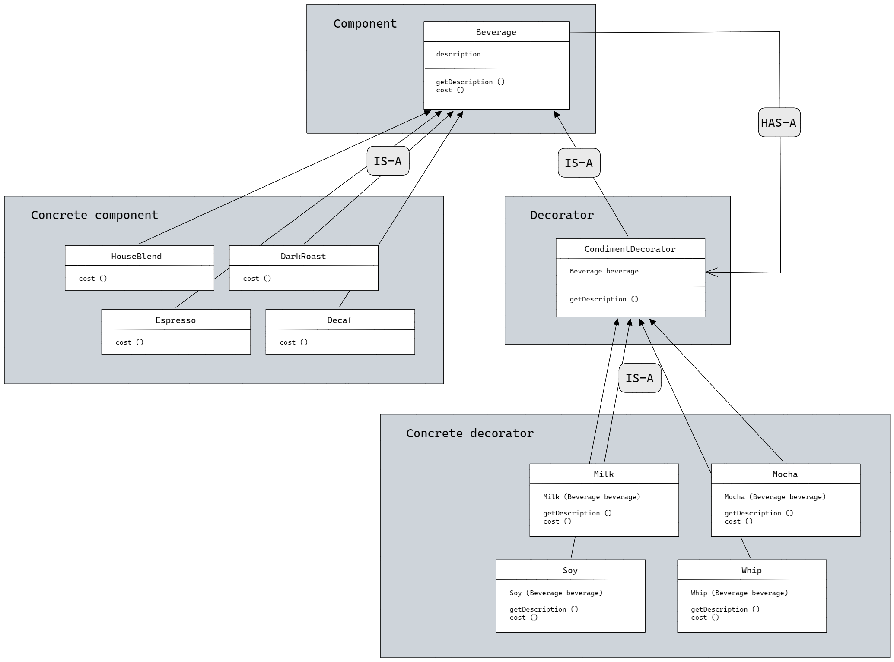
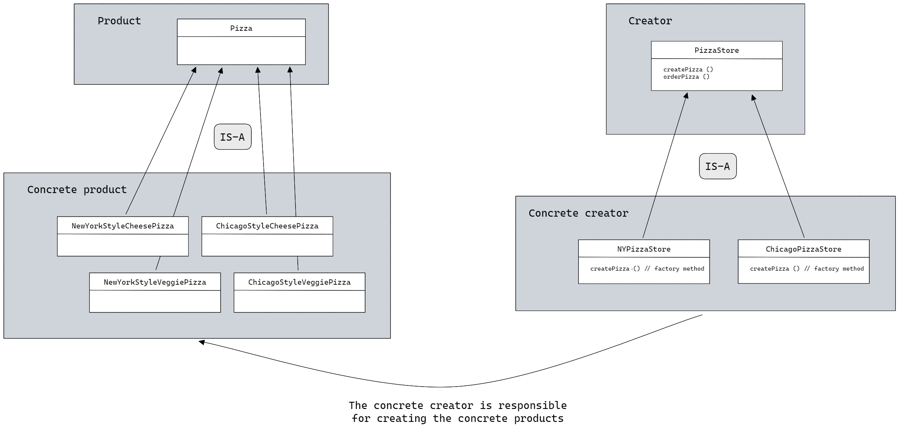

<style>
    .top-anchor, .previous-chapter-anchor, .previous-header-anchor {
        float:right;
        font-size:2em;
    }

    .previous-chapter-anchor, .previous-header-anchor {
        margin-right:10px;
    }
</style>

# Head First Design Patterns - My Notes

### Contents

- [A few reminders](#a-few-reminders)
  - [Quick terminology reminder](#quick-terminology-reminder)
  - [Vocabulary](#vocabulary)
  - [A few important points about Java and coding](#a-few-important-points-about-java-and-coding)
  - [SOLID](#solid)
- [Chapter 1 : Intro to design pattern](#chapter-1--intro-to-design-pattern)
  - [SimUDuck](#simuduck)
  - [Class diagram of the strategy pattern](#class-diagram-of-the-strategy-pattern)
  - [Code example](#code-example)
- [Chapter 2 : Keeping your objects in the know](#chapter-2--keeping-your-objects-in-the-know)
  - [Weather-O-Rama](#weather-o-rama)
  - [Class diagram of the observer pattern](#class-diagram-of-the-observer-pattern)
  - [Code example](#code-example-1)
  - [Class diagram of the Java's built-in observer pattern](#class-diagram-of-the-javas-built-in-observer-pattern)
  - [Built-in observers vs custom observers](#built-in-observers-vs-custom-observers)
  - [Observer pattern in the JDK](#observer-pattern-in-the-jdk)
- [Chapter 3 : Decorating objects](#chapter-3--decorating-objects)
  - [Starbuzz Coffee](#starbuzz-coffee)
  - [Class diagram of the decorator pattern](#class-diagram-of-the-decorator-pattern)
  - [Code example](#code-example-2)
  - [Decorators in Java packages](#decorators-in-java-packages)
- [Chapter 4 : Baking with OO goodness](#chapter-4--baking-with-oo-goodness)
  - [App](#app)
  - [Class diagram of the factory method pattern](#class-diagram-of-the-factory-method-pattern)
- [OOP basic principles](#oop-basic-principles)
- [Design principles list](#design-principles-list)
- [Design pattern catalog](#design-pattern-catalog)

<hr/>

### A few reminders

#### Quick terminology reminder

(source : https://docs.oracle.com/javase/tutorial/)

- A field is a class, interface, or enum with an associated value.
- An object stores its state in fields.
- Four kinds of variables :
  - **Instance variables (non-static fields)** Their values are unique to each instance of a class
  - **Class variables (static fields)** There is exactly one copy of this variable in existence, regardless of how many times the class has been instantiated.
  - **Local variables** are only visible to the methods in which they are declared
  - **Parameters** are always classified as "variables" not "fields".
- **Data Encapsulation** is hidding internal state and requiring all interaction to be performed through an object's methods.

(source : Head First : Java)

- **static** :
  - A static method/variable means “behavior not dependent on an instance variable, so no instance/object is required. Just the class.”
  - As a convention, static variables (constants) are written in all caps.
  - A static initializer inside the class `static { // Assign here }` can be used to assign your static variables. In any cases, do not forget to initialize or assign them otherwise the compiler will return an error.
  - By the way, there IS a Java `const` keyword. However it is **never** used, only reserved. (So are `goto` and `strictfp`)
- **final** :

  - A final class guarantees no methods can be overridden.
  - A final method cannot be overridden.
  - A final variable, once initialized, can never be changed.

  [For more keywords ...](https://en.wikipedia.org/wiki/List_of_Java_keywords)

#### Vocabulary

- **wrapper method** : A method that calls another method without doing much additional work.
- **HAS-A** : One class "has" an instance of another class or interface as one of its fields.
- **IS-A** : A relationship between two classes where one class extends another class; the subclass "is" an instance of the superclass.
- **Encapsulate** : On a small scale, it is to wrap a sequence of statements in a method. On a larger one, it is to wrap binded classes under a supertype (a class or interface).

#### A few important points about Java and coding

- How to write code flexible enough to handle both changes and reuse of code.
- Inheritance affects all.
- A class can extend one class only and implement any number of interfaces simultaneously.
- On interfaces :
  - An interface can extend multiple interfaces.
  - An interface affects only the ones that implement it.
  - Disadvantage : if something need to be modified, one would need to modify each single-handedly.
  - Java 8 supports default methods where interfaces can provide a default implementation of methods.
- If a bit of code regularly changes, encapsulate it.
- Change is a constant in programming. (New feature, new expectation from the client, new language, ...)

#### SOLID

[**SOLID**](https://en.wikipedia.org/wiki/SOLID) : five design principles intended to make object-oriented designs more understandable, flexible, and maintainable.

- [Single Responsibility Principle](https://en.wikipedia.org/wiki/Single-responsibility_principle) : Every class should have only one responsibility.
- [Open/Closed Principle](https://en.wikipedia.org/wiki/Open%E2%80%93closed_principle) : "Software entities ... should be open for extension, but closed for modification."
- [Liskov substitution Principle](https://en.wikipedia.org/wiki/Liskov_substitution_principle) : "Functions that use pointers or references to base classes must be able to use objects of derived classes without knowing it."
- [Interface segregation principle](https://en.wikipedia.org/wiki/Interface_segregation_principle) : "Clients should not be forced to depend upon interfaces that they do not use."
- [Dependency inversion principle](https://en.wikipedia.org/wiki/Dependency_inversion_principle) : "Depend upon abstractions, [not] concretions."

<span class="top-anchor">[⇯](#head-first-design-patterns---my-notes)</span>

<!-- <span class="previous-chapter-anchor">[⇮](#head-first-design-patterns---my-notes)</span> -->

<span class="previous-header-anchor">[⇧](#a-few-reminders)</span>
<br/>

## Chapter 1 : Intro to design pattern

### SimUDuck

<!-- (p3) -->

You are part of the coding team of a duck pond simulation game that holds a large variety of duck species.

The simulator is in constant evolution. New ducks may be added and a duck's behavior can be reused or unique. Furthermore a duck's behavior can evolved in-game.

The coding team tried using inheritance, however it proved too binding. Then interfaces were implemented, it lacked flexibility.

So what to do ? Luckily, there's a design principle for just this case.

##### Design principle

> **Identify the aspects of your application that vary and separate them from what stays the same.**

In other words, encapsulate the parts that vary, so that later you can alter or extend them independently and not affect the ones that stay the same.

##### Design principle

> **Program to an interface, not an implementation.**

The behaviors that change are out of the Duck superclass.

<span class="top-anchor">[⇯](#head-first-design-patterns---my-notes)</span>
<span class="previous-chapter-anchor">[⇮](#chapter-1--intro-to-design-pattern)</span>
<span class="previous-header-anchor">[⇧](#simuduck)</span>
<br/>

### Class diagram of the strategy pattern

##### Design principle

> **Favor composition over inheritance.**



**The STRATEGY pattern defines a family of algorithms, encapsulates each one, and makes them interchangeable. Strategy lets the algorithm vary independently from clients that use it.**

<span class="top-anchor">[⇯](#head-first-design-patterns---my-notes)</span>
<span class="previous-chapter-anchor">[⇮](#chapter-1--intro-to-design-pattern)</span>
<span class="previous-header-anchor">[⇧](#class-diagram-of-the-strategy-pattern)</span>
<br/>

### Code example

FlyBehavior.java

```java
interface FlyBehavior {
    public void fly ();
}
```

FlyWithWings.java

```java
class FlyWithWings implements FlyBehavior {
    public void fly () {
        System.out.println("Look at me I'm flying !");
    }
}
```

FlyNoWay.java

```java
class FlyNoWay implements FlyBehavior {
    public void fly () {
        // do nothing
    }
}
```

QuackBehavior.java

```java
interface QuackBehavior {
    public void quack ();
}
```

Quack.java

```java
class Quack implements QuackBehavior {
    public void quack () {
        System.out.println("Quack, quack, quack !");
    }
}
```

Squeak.java

```java
class Squeak implements QuackBehavior {
    public void quack () {
        System.out.println("Squeak, squeak, squeak !");
    }
}
```

Mute.java

```java
class Mute implements QuackBehavior {
    public void quack () {
        // do nothing
    }
}
```

Duck.java

```java
abstract class Duck {
    FlyBehavior flyBehavior;
    QuackBehavior quackBehavior;

    public Duck () {}

	public abstract void display ();

    public void swim () {
        System.out.println("All ducks float, even the decoys !");
    }

    // wrapper method
    public void performFly () {
        flyBehavior.fly();
    }

    public void performQuack () {
        quackBehavior.quack();
    }

    public void setFlyBehavior(FlyBehavior fb){
        flyBehavior = fb;
    }

    public void setFlyBehavior(QuackBehavior qb){
        quackBehavior = qb;
    }
}
```

MallardDuck.java

```java
class MallardDuck extends Duck {
    public MallardDuck () {
        flyBehavior = new FlyWithWings();
        quackBehavior = new Quack();
    }

	public void display () {
        System.out.println("I am a Mallard !");
    }
}
```

RedHeadDuck.java

```java
class RedHeadDuck extends Duck {
    public RedHeadDuck () {
        flyBehavior = new FlyWithWings();
        quackBehavior = new Quack();
    }

	public void display () {
        System.out.println("I am a RedHead !");
    }
}
```

RubberDuck.java

```java
class RubberDuck extends Duck {
    public RubberDuck () {
        flyBehavior = new FlyNoWay();
        quackBehavior = new Squeak();
    }

    public void display () {
        System.out.println("I am a rubber ducky !");
    }
}
```

DecoyDuck.java

```java
class DecoyDuck extends Duck {
    public DecoyDuck () {
        flyBehavior = new FlyNoWay();
        quackBehavior = new Mute();
    }

    public void display () {
        System.out.println("I am a decoy !");
    }
}
```

ModelDuck.java

```java
class ModelDuck extends Duck {
    public ModelDuck () {
        flyBehavior = new FlyNoWay();
        quackBehavior = new Quack();
    }

    public void display () {
        System.out.println("I am a model duck !");
    }
}
```

FlyRocketPowered.java

```java
class FlyRocketPowered implements FlyBehavior {
    public void fly () {
        System.out.println("I'm a rocket duck !");
    }
}
```

MiniDuckSimulator.java

```java
class MiniDuckSimulator {
    public static void main (String[] args) {
        Duck mallardDuck = new MallardDuck();
        Duck redHeadDuck = new RedHeadDuck();
        Duck rubberDuck = new RubberDuck();
        Duck decoyDuck = new DecoyDuck();

        Duck[] allMyDucksInARow = {
            mallardDuck,
            redHeadDuck,
            rubberDuck,
            decoyDuck,
        };

        for(Duck duck : allMyDucksInARow) {
            duck.display();
            duck.swim();
            duck.performFly();
            duck.performQuack();
        }

        Duck modelDuck = new ModelDuck();

        modelDuck.performFly();
        modelDuck.setFlyBehavior(new FlyRocketPowered());
        modelDuck.performFly();
    }
}
```

To change a duck's behavior at runtime (in the main method), just call the duck's setter method for that behavior.

- Run the code

Test the code with the following commands (in PowerShell)

```sh
javac -d .\class\ .\MiniDuckSimulator.java
java -cp .\class\ MiniDuckSimulator
```

**You have just learned your first design pattern : the STRATEGY pattern**

<span class="top-anchor">[⇯](#head-first-design-patterns---my-notes)</span>
<span class="previous-chapter-anchor">[⇮](#chapter-1--intro-to-design-pattern)</span>
<span class="previous-header-anchor">[⇧](#code-example)</span>
<br/>

## Chapter 2 : Keeping your objects in the know

<!-- (p39) -->

### Weather-O-Rama

Your next assignment is to built a internet-based weather monitoring station, Weather-O-Rama.
The application will serve 3 display elements and an API for developpers to serve their own weather displays, _all updated in real time_.

<span class="top-anchor">[⇯](#head-first-design-patterns---my-notes)</span>
<span class="previous-chapter-anchor">[⇮](#chapter-2--keeping-your-objects-in-the-know)</span>
<span class="previous-header-anchor">[⇧](#weather-o-rama)</span>
<br/>

### Class diagram of the observer pattern



<br/>

**The OBSERVER pattern defines a one-to-many dependency between objects so that when one object changes state, all of its dependents are notified and updated automatically.**

##### Design principle

> **Strive for loosely coupled designs between objects that interact.**

<span class="top-anchor">[⇯](#head-first-design-patterns---my-notes)</span>
<span class="previous-chapter-anchor">[⇮](#chapter-2--keeping-your-objects-in-the-know)</span>
<span class="previous-header-anchor">[⇧](#class-diagram-of-the-observer-pattern)</span>
<br/>

### Code example

Subject.java

```java
interface Subject {
    public void registerObserver(Observer o);
    public void removeObserver(Observer o);
    public void notifyObservers();
}
```

Observer.java

```java
interface Observer {
    public void update(float temperature, float humidity, float pressure);
}
```

DisplayElement.java

```java
interface DisplayElement {
    public void display();
}
```

WeatherData.java

```java
class WeatherData implements Subject {
    private ArrayList observers;
    private float temperature;
    private float humidity;
    private float pressure;

    public void WeatherData(){
        observers = new ArrayList();
    }

    public void registerObserver(Observer o){
        observers.add(o);
    }

    public void removeObserver(Observer o){
        int i = observers.indexOf(o);
        if (i >= 0){
            observers.remove(i);
        }
    }

    public void notifyObservers(){
        for(int i = 0; i < observers.size(); i++>){
            Observer observer = (Observer)observers.get(i);
            observer.update(temperature, humidity, pressure);
        }
    }

    public void measurementsChanged(){
        notifyObservers();
    }

    public void setMeasurements(float temperature, float humidity, float pressure){
        this.temperature = temperature;
        this.humidity = humidity;
        this.pressure = pressure;
        measurementsChanged();
    }
}
```

CurrentConditionsDisplay.java

```java
class CurrentConditionsDisplay implements Observer, DisplayElement {
    private float temperature;
    private float humidity;
    private Subject weatherData;

    public CurrentConditionsDisplay(Subject weatherData) {
        this.weatherData = weatherData;
        weatherData.registerObserver(this);
    }

    public void update(float temperature, float humidity, float pressure) {
        this.temperature = temperature;
        this.humidity = humidity;
        display();
    }

    public void display() {
        System.out.println(
            "Current conditions : " + temperature +
            "F degrees and " + humidity + "% humidity"
        );
    }
}
```

StatisticsDisplay.java

```java
class StatisticsDisplay implements Observer, DisplayElement {
	private float maxTemp = 0.0f;
	private float minTemp = 200;
	private float tempSum= 0.0f;
	private int numReadings;
	private WeatherData weatherData;

	public StatisticsDisplay(WeatherData weatherData) {
		this.weatherData = weatherData;
		weatherData.registerObserver(this);
	}

	public void update(float temp, float humidity, float pressure) {
		tempSum += temp;
		numReadings++;

		if (temp > maxTemp) {
			maxTemp = temp;
		}

		if (temp < minTemp) {
			minTemp = temp;
		}

		display();
	}

	public void display() {
		System.out.println(
            "Avg/Max/Min temperature = " +
            (tempSum / numReadings) +
            "/" + maxTemp + "/" + minTemp
        );
	}
}
```

ForecastDisplay.java

```java
class ForecastDisplay implements Observer, DisplayElement {
	private float currentPressure = 29.92f;
	private float lastPressure;
	private WeatherData weatherData;

	public ForecastDisplay(WeatherData weatherData) {
		this.weatherData = weatherData;
		weatherData.registerObserver(this);
	}

	public void update(float temp, float humidity, float pressure) {
        lastPressure = currentPressure;
		currentPressure = pressure;

		display();
	}

	public void display() {
		System.out.print("Forecast: ");

		if (currentPressure > lastPressure) {
			System.out.println("Improving weather on the way!");
		} else if (currentPressure == lastPressure) {
			System.out.println("More of the same");
		} else if (currentPressure < lastPressure) {
			System.out.println("Watch out for cooler, rainy weather");
		}
	}
}
```

WeatherStation.java

```java
class WeatherStation {

    public static void main(String[] args) {
        WeatherData weatherData = new WeatherData();

        CurrentConditionsDisplay currentConditionsDisplay = new CurrentConditionsDisplay(weatherData);
        StatisticsDisplay StatisticsDisplay = new StatisticsDisplay(weatherData);
        ForecastDisplay forecastDisplay = new ForecastDisplay(weatherData);

        weatherData.setMeasurements(80, 65, 30.4f);
        weatherData.setMeasurements(82, 70, 29.2f);
        weatherData.setMeasurements(78, 90, 29.2f);
    }
}
```

**Note :** _The HeatIndexDisplay was added as an exercise. It also shows what a developper would have to do using the API._

<span class="top-anchor">[⇯](#head-first-design-patterns---my-notes)</span>
<span class="previous-chapter-anchor">[⇮](#chapter-2--keeping-your-objects-in-the-know)</span>
<span class="previous-header-anchor">[⇧](#code-example-1)</span>
<br/>

### Class diagram of the Java's built-in observer pattern

**NOTE :** There was a built-in Observable/Observer (java.util) and it is now deprecated. See [the next chapter](#built-in-observers-vs-custom-observers) for some clues as to why. Thus I will only leave the diagram of the built-in obervable pattern below.

<br/>



<span class="top-anchor">[⇯](#head-first-design-patterns---my-notes)</span>
<span class="previous-chapter-anchor">[⇮](#chapter-2--keeping-your-objects-in-the-know)</span>
<span class="previous-header-anchor">[⇧](#class-diagram-of-the-javas-built-in-observer-pattern)</span>
<br/>

### Built-in observers vs custom observers

- Observable is a class so WeatherData is stuck having it as a superclass. This limits the reuse and customization potential.
- The built-in Observable design violates the second design principle _favor composition over inheritance_
- The built-in Observable is quick to set up, however you will lose some flexibilty. You now know how to built your own Observer : Do not be afraid to use it, if it fits your needs !

<span class="top-anchor">[⇯](#head-first-design-patterns---my-notes)</span>
<span class="previous-chapter-anchor">[⇮](#chapter-2--keeping-your-objects-in-the-know)</span>
<span class="previous-header-anchor">[⇧](#built-in-observers-vs-custom-observers)</span>
<br/>

### Observer pattern in the JDK

JavaBeans and Swing also provide their own implementation of the observer pattern. (See _chapter 2 page 72_ of the book **Head First : Design Patterns**)

<span class="top-anchor">[⇯](#head-first-design-patterns---my-notes)</span>
<span class="previous-chapter-anchor">[⇮](#chapter-2--keeping-your-objects-in-the-know)</span>
<span class="previous-header-anchor">[⇧](#observer-pattern-in-the-jdk)</span>
<br/>

## Chapter 3 : Decorating objects

<!-- (p81) -->

### Starbuzz Coffee

You are working for the fast growing company Starbuzz. They are often adding new beverages and toppings. However it has brought problems to their ordering system. Use your design pattern power to solve this new task.

Each beverage can be served with zero, one or many toppings. Also, the same topping can be added more than once.

##### Design principle

> **Classes should be open for extension, but closed for modification.**

<span class="top-anchor">[⇯](#head-first-design-patterns---my-notes)</span>
<span class="previous-chapter-anchor">[⇮](#chapter-3--decorating-objects)</span>
<span class="previous-header-anchor">[⇧](#starbuzz-coffee)</span>
<br/>

### Class diagram of the decorator pattern



<br/>

**The DECORATOR pattern attaches additional responsibilities to an object dynamically. Decorators provide a flexible alternative to subclassing for extending functionality.**

<span class="top-anchor">[⇯](#head-first-design-patterns---my-notes)</span>
<span class="previous-chapter-anchor">[⇮](#chapter-3--decorating-objects)</span>
<span class="previous-header-anchor">[⇧](#class-diagram-of-the-decorator-pattern)</span>
<br/>

### Code example

#### Component

Beverage.java

```java
abstract class Beverage {
    String description = "Unknown Beverage";

    public String getDescription() {
        return description;
    }

    public abstract double cost();
}
```

#### Decorator

CondimentDecorator.java

```java
abstract class CondimentDecorator extends Beverage {
	Beverage beverage;
	public abstract String getDescription();
}
```

#### Concrete components (beverages)

Espresso.java

```java
class Espresso extends Beverage {

    public Espresso() {
        description = "Espresso";
    }

    public double cost() {
        return 1.99;
    }
}
```

HouseBlend.java

```java
class HouseBlend extends Beverage {
    public HouseBlend() {
        description = "House Blend Coffee";
    }

    public double cost() {
        return .89;
    }
}
```

DarkRoast.java

```java
class DarkRoast extends Beverage {
    public DarkRoast() {
        description = "Dark Roast Coffee";
    }

    public double cost() {
        return .99;
    }
}
```

Decaf.java

```java
class Decaf extends Beverage {
    public Decaf() {
        description = "Decaf Coffee";
    }

    public double cost() {
        return 1.05;
    }
}
```

#### Concrete decorators (condiments)

Mocha.java

```java
class Mocha extends CondimentDecorator {
    public Mocha(Beverage beverage) {
        this.beverage = beverage;
    }

    public String getDescription() {
        return beverage.getDescription() + ", Mocha";
    }

    public double cost() {
        return .20 + beverage.cost();
    }
}
```

Milk.java

```java
class Milk extends CondimentDecorator {
    public Milk(Beverage beverage) {
        this.beverage = beverage;
    }

    public String getDescription() {
        return beverage.getDescription() + ", Milk";
    }

    public double cost() {
        return .10 + beverage.cost();
    }
}
```

Soy.java

```java
class Soy extends CondimentDecorator {
    public Soy(Beverage beverage) {
        this.beverage = beverage;
    }

    public String getDescription() {
        return beverage.getDescription() + ", Soy";
    }

    public double cost() {
        return .15 + beverage.cost();
    }
}
```

Whip.java

```java
class Whip extends CondimentDecorator {
    public Whip(Beverage beverage) {
        this.beverage = beverage;
    }

    public String getDescription() {
        return beverage.getDescription() + ", Whip";
    }

    public double cost() {
        return .10 + beverage.cost();
    }
}
```

#### The main() method

StarbuzzCoffee.java

```java
class StarbuzzCoffee {

    public static void main(String args[]) {
        Beverage beverage = new Espresso();
        System.out.println(beverage.getDescription()
                + " $" + beverage.cost());

        Beverage beverage2 = new DarkRoast();
        beverage2 = new Mocha(beverage2);
        beverage2 = new Mocha(beverage2);
        beverage2 = new Whip(beverage2);
        System.out.println(beverage2.getDescription()
                + " $" + beverage2.cost());

        Beverage beverage3 = new HouseBlend();
        beverage3 = new Soy(beverage3);
        beverage3 = new Mocha(beverage3);
        beverage3 = new Whip(beverage3);
        System.out.println(beverage3.getDescription()
                + " $" + beverage3.cost());
    }
}
```

<span class="top-anchor">[⇯](#head-first-design-patterns---my-notes)</span>
<span class="previous-chapter-anchor">[⇮](#chapter-3--decorating-objects)</span>
<span class="previous-header-anchor">[⇧](#code-example-2)</span>
<br/>

### Decorators in Java packages

The `java.io` package is largely based on the use of decorators.

_The following isn't an exhaustive list._

- _Component_ : InputStream
- _Concrete components_ : FileInputStream, StringBufferInputStream, ByteArrayInputStream
- _Decorator_ : FilterInputStream
- _Concrete decorators_ : PushbackInputStream, BufferedInputStream, DataInputStream, LineNumberInputStream

<span class="top-anchor">[⇯](#head-first-design-patterns---my-notes)</span>
<span class="previous-chapter-anchor">[⇮](#chapter-3--decorating-objects)</span>
<span class="previous-header-anchor">[⇧](#decorators-in-java-packages)</span>
<br/>

## Chapter 4 : Baking with OO goodness

<!-- (p111) -->

### Pizzaiolo

p 119 simple factory diagram (sf is an idiom not a pattern. Refactoring by encapsulating the instanciation process)

**p 141**

<span class="top-anchor">[⇯](#head-first-design-patterns---my-notes)</span>
<span class="previous-chapter-anchor">[⇮](#chapter-4--baking-with-oo-goodness)</span>

<!-- <span class="previous-header-anchor">[⇧](#)</span> -->
<br/>

### Class diagram of the factory method pattern



**The FACTORY METHOD pattern defines an interface for creating an object, but lets subclasses decide which class to instantiate. Factory method lets a class defer instantiation to subclasses.**

<span class="top-anchor">[⇯](#head-first-design-patterns---my-notes)</span>

<!-- <span class="previous-chapter-anchor">[⇮](#)</span>
<span class="previous-header-anchor">[⇧](#)</span> -->
<br/>

### Code example

Class.java

```java
class Class {

}
```

##### Design principle

> **Depend upon abstractions. Do not depend upon concrete classes.**

<!-- Begin of clone, chapter # : ... -->

<span class="top-anchor">[⇯](#head-first-design-patterns---my-notes)</span>

<!-- <span class="previous-chapter-anchor">[⇮](#)</span>
<span class="previous-header-anchor">[⇧](#)</span> -->
<br/>

## Chapter # : ...

<!-- (p) -->

### App

<span class="top-anchor">[⇯](#head-first-design-patterns---my-notes)</span>

<!-- <span class="previous-chapter-anchor">[⇮](#)</span>
<span class="previous-header-anchor">[⇧](#)</span> -->
<br/>

### Class diagram of the ... pattern


**The DESIGN pattern**

<span class="top-anchor">[⇯](#head-first-design-patterns---my-notes)</span>

<!-- <span class="previous-chapter-anchor">[⇮](#)</span>
<span class="previous-header-anchor">[⇧](#)</span> -->
<br/>

### Code example

Class.java

```java
class Class {

}
```

<!-- End of clone, chapter # : ... -->

<hr/>

<span class="top-anchor">[⇯](#head-first-design-patterns---my-notes)</span>

<!-- <span class="previous-chapter-anchor">[⇮](#)</span> -->
<!-- <span class="previous-header-anchor">[⇧](#)</span> -->
<br/>

### OOP basic principles

- **Abstraction** is used when you have a superclass' method that is defined in the subclass.
- **Encapsulation** is keeping private fields and use public methods to let other classes work with only the parts they need to see.
- **Polymorphism** is when subclasses of a class can define their own unique behaviors and yet share some of the same functionality of the parent class.
- **Inheritance** is inheriting the properties of a parent (class or interface) into a child (class or interface).

[For more details, see : A few reminders](#a-few-reminders)

<span class="top-anchor">[⇯](#head-first-design-patterns---my-notes)</span>

<!-- <span class="previous-chapter-anchor">[⇮](#)</span> -->

<span class="previous-header-anchor">[⇧](#oop-basic-principles)</span>
<br/>

### Design principles list

The **strategy** pattern

- Encapsulates what varies.
- Program to an interface, not an implementation.
- Favor composition over inheritance.

The **observer** pattern

- Strive for loosely coupled designs between objects that interact.

The **decorator** pattern

- Classes should be open for extension, but closed for modification.

The **...** pattern

- ...

The **...** pattern

- ...

<span class="top-anchor">[⇯](#head-first-design-patterns---my-notes)</span>

<!-- <span class="previous-chapter-anchor">[⇮](#)</span> -->

<span class="previous-header-anchor">[⇧](#design-principles-list)</span>
<br/>

### Design pattern catalog

- Creational pattern
  - Abstract factory
  - Builder
  - Factory method
  - Prototype
  - Singleton
- Structural pattern
  - Adapter
  - Bridge
  - Composite
  - [Decorator](#class-diagram-of-the-decorator-pattern)
  - Facade
  - Flyweight
  - Proxy
- Behavioral pattern
  - Chain of responsibility
  - Command
  - Interpreter
  - Mediator
  - Mememto
  - [Observer](#class-diagram-of-the-observer-pattern)
  - State
  - [Strategy](#class-diagram-of-the-strategy-pattern)
  - Template method
  - Visitor

stopped at page 67
